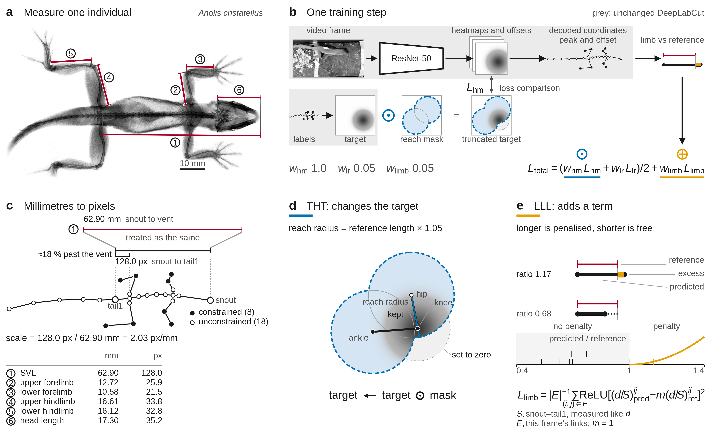

> ### ⚠️ This is **not** the official DeepLabCut repository
>
> This is a **research fork** of [DeepLabCut](https://github.com/DeepLabCut/DeepLabCut),
> created for a single methods study. It is **not maintained**, **not a supported release**, and
> **not affiliated with or endorsed by** the DeepLabCut team or the Mathis Lab.
>
> **If you are looking for DeepLabCut, go to
> [github.com/DeepLabCut/DeepLabCut](https://github.com/DeepLabCut/DeepLabCut).**
> Do not install this fork expecting upstream behaviour, and please do not file DeepLabCut issues here.
>
> The upstream project's own README is preserved verbatim as
> [`README_upstream_DLC.md`](README_upstream_DLC.md).

# Anatomical priors for markerless pose estimation — DeepLabCut research fork

Companion code for:

> **Integrating body trait reference measurements improves deep learning pose estimation**
> Spiridonov, Hoffman, DiMuro, Annapareddy, Clay, Appleton, Shi & Stroud.
> *(submitted)*

Forked from DeepLabCut **v3.0.0rc11** (PyTorch engine).

Markerless pose estimators have no internal model of the animal they are tracking, so they can
predict limb configurations that are anatomically impossible for the individual filmed. This fork
adds two mechanisms that inject **per-specimen X-ray bone measurements** into DeepLabCut training as
anatomical priors, and the cross-validation machinery used to evaluate them.



**(a)** A dorsal radiograph gives six reference lengths per individual. **(b)** The two mechanisms
enter training at different points — target heatmap truncation (blue) multiplies the *target* before
the heatmap loss; the limb length loss (orange) *adds a term* on the decoded coordinates.
**(c)** Millimetres are converted to pixels via a per-frame body-length scale. **(d)** THT zeroes the
target outside the reachable union of the adjacent joints' discs. **(e)** LLL penalises only limbs
predicted *longer* than the reference — foreshortening is free.

---

## The two mechanisms

**Limb length loss (LLL)** — an extra loss term. For each reference link, the predicted 2D distance
(normalised by body length) is compared against the X-ray measurement (normalised the same way), and
the excess beyond `m ×` the reference is squared. Predictions *shorter* than the reference cost
nothing, because a 3D limb legitimately foreshortens when projected into an image. The penalty is a
**mean over the contributing links**, and the loss acts on the decoded coordinates.

**Target heatmap truncation (THT)** — modifies the training *target*, not the loss. For each of the 8
limb landmarks, a disc is drawn around every skeletally adjacent joint with radius `r ×` that bone's
reference length; the Gaussian target is multiplied by the union of those discs. Location-refinement
targets are untouched.

---

## What was changed

### Modified upstream files

| File | Change |
|---|---|
| `deeplabcut/pose_estimation_pytorch/runners/train.py` | LLL implementation (`compute_skeletal_constraint_loss*`), THT target masking (`apply_skeletal_target_masking*`), and the wiring that reads the config flags in the train step. The bulk of the additions. |
| `deeplabcut/pose_estimation_pytorch/data/dataset.py` | `create_skeleton_dictionary` (loads per-specimen X-ray measurements and maps CSV columns to landmark pairs) and `SkeletalPoseDataset`, which attaches per-frame skeletal data. |
| `deeplabcut/pose_estimation_pytorch/data/base.py` | Resolves the skeletal-data CSV path and the SVL landmark pair from the project/model config. |

### Added files

| File | Purpose |
|---|---|
| `deeplabcut/pose_estimation_pytorch/skeletal_config.py` | Shared config resolution for the skeletal options (incl. `resolve_svl_landmarks`). |
| `run_cv.py` | Main experiment runner — *k*-fold × multi-seed cross-validation, applies train-config overrides, collects results. This is the entry point that produced every number in the paper. |
| `analyze_cv_results.py`, `analyze_cv_results_pp.py`, `analyze_cv_omnibus.py` | Aggregate results; paired permutation and Wilcoxon tests; repeated-measures ANOVA / Friedman omnibus. |
| `analyze_body_length_vs_confidence.py`, `predict_body_length_error_rf.py` | Body-length error analyses. |
| `plot_lc_results.py`, `plot_all_results*.py`, `summarize_results.py` | Figures and summary tables. |
| `example_skeletal_loss.py` | Minimal usage example. |
| `test_*.py` | Development test scripts for the skeletal loss and masking (ad-hoc, not a formal suite). |
| `CHANGES_DETAILED.md`, `SKELETAL_CONSTRAINT_IMPLEMENTATION.md`, others | Development notes kept for transparency. |

---

## Usage

Both mechanisms are gated on skeletal data being available: if the project config has no
`lizard_skeletal_data_path`, training behaves exactly as upstream DeepLabCut.

> ⚠️ **Once `lizard_skeletal_data_path` is set, the limb length loss is active** — and if
> `skeletal_loss_weight` is not given it falls back to **`0.10`**, not zero. Set it explicitly
> (`0.05` is the value reported in the paper; `0.0` disables LLL while leaving the data pipeline in
> place). THT stays off until `truncate_targets: true`.

### 1. Provide per-specimen measurements

A CSV keyed by specimen ID, with millimetre measurements:

```
lizard_id,svl,head.length,upper.forelimb,lower.forelimb,upper.hindlimb,lower.hindlimb
2,57.81,15.01,11.48,8.31,14.46,13.64
```

Point the **project** `config.yaml` at it:

```yaml
lizard_skeletal_data_path: /path/to/morphology.csv
```

Specimen IDs are taken from the first underscore-delimited field of the video folder name
(`0002_2/img123.png` → specimen `0002`).

### 2. Enable the mechanisms

These go in the **model** config (`pytorch_config.yaml`), or as `train_overrides` in `run_cv.py`:

| Option | Default | Meaning |
|---|---|---|
| `skeletal_loss_weight` | `0.10` | LLL weight (`w_limb`). `0.05` is the value reported; `0.0` disables LLL. Applies only when skeletal data is loaded. |
| `skeletal_loss_radius_multiplier` | `1.0` | LLL tolerance `m`. Penalty fires above `m ×` reference. |
| `skeletal_loss_svl_mode` | `ground_truth_svl` | `ground_truth_svl` or `predicted_svl` for the scale normaliser. |
| `skeletal_loss_svl_confidence_threshold` | `0.5` | Minimum endpoint confidence for a link to contribute. |
| `svl_landmarks` | `['snout','tail1']` | Landmark pair defining the pixel-side body length. |
| `truncate_targets` | `false` | Enables THT. |
| `skeletal_radius_multiplier_start` / `_end` | `1.1` | THT radius multiplier `r` (set both equal for a constant radius). |
| `use_skeletal_reference` | — | `true`: radius from the X-ray reference lengths. `false`: radius from the ground-truth 2D distance between adjacent landmarks. |
| `union_intersect_adjacent_skeletal_mask_alpha_start` / `_end` | `0.0` / `1.0` | Blends union (0) → intersection (1) of adjacent discs. All reported runs use `0.0` (union). |
| `skeletal_mask_half_cell_fix` | `false` | Builds the truncation disc in the cell-centre frame, matching the Gaussian target. |
| `skeletal_mask_preserve_peak` | `false` | Prevents the mask from zeroing the target's peak cell. |
| `body_length_error_mean` / `_std` | `0.0` / `0.05` | Optional synthetic error injected into reference body lengths (`std < 0` disables). |

### 3. Run cross-validation

```bash
python run_cv.py
```

Edit the `experiment` dict at the bottom of `run_cv.py` to set `experiment_id` and `train_overrides`.
Results are written to `cv_results_{experiment_id}.csv`.

> **Note on `skeletal_mask_half_cell_fix` / `skeletal_mask_preserve_peak`:** both default to `false`,
> which reproduces the configurations reported in the paper. Setting them to `true` corrects a
> half-cell offset in the mask geometry and prevents the peak cell of the Gaussian target from being
> clipped; the paper reports what happens either way.

---

## Results files

`release/paper_results.zip` contains the numerical results underlying the paper's tables and figures:

- `cv_results_*.csv` — aggregate cross-validation results, one row per (fold, seed). The
  `override__*` columns record the exact configuration each run used.
- `cv_loss_curve_*.csv` — per-fold, per-seed training/test loss curves.
- `all_results.csv` — rolling aggregate snapshot.

Experiment IDs follow `control` (baseline), `ll_0d05` (LLL at `w = 0.05`), `tht_gt_1d05`
(THT, ground-truth radius, `r = 1.05`), with `d` standing in for the decimal point and `__` joining
combined configurations.

Per-image frame-level predictions (`cv_frame_level_results_*.csv`) are **not** distributed — they run
to ~560 MB and are intermediate artefacts rather than results the paper reports. They can be
regenerated from this repository by re-running `run_cv.py` with `SAVE_FRAME_LEVEL_RESULTS = True`.

---

## License

This fork inherits DeepLabCut's **LGPL-3.0** license — see [`LICENSE`](LICENSE). Please cite both
DeepLabCut and the paper above if you use this code.

---

<sub>**Disclaimer:** this README was drafted with Claude (Anthropic) and reviewed by the authors.
The code, experiments and results it describes are the authors' own.</sub>
